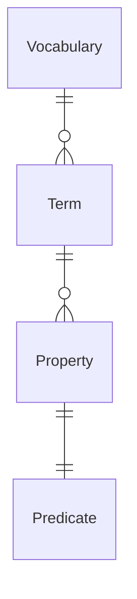

# Vocabulary Model Timestamps

## Introduction

This document provides the rationale and behavior of the timestamps for the
`Vocabulary` and associated `Term` and `Property` models.

## Vocabulary Relationship Diagram

The `Predicate` model is included in the above diagram for completeness, but
will not be further discussed in this document, as it exists outside the
add/edit/delete workflow of the `Vocabulary` model.

## Timestamps

The following are the timestamps available for each model:

| Timestamp | Vocabulary | Term | Property |
| --------- | ---------- | ---- | -------- |
| created   | ✅         | ✅   | ✅       |
| modified  | ✅         | ✅   | ✅       |
| deleted   |            | ✅   | ✅       |
| updated   | ✅         |      |          |
| published | ✅         |      |          |

* created - the timestamp the database record was created
* modified - the timestamp the database record was last changed (including
  soft deletion for `Term` and `Property` models, as an implementation detail)
* deleted - The timestamp the database record was "soft deleted"
* updated - The latest timestamp for the "modified" field of the `Vocabulary`
  model, or any of its dependent `Term` or `Property` models.
* published - The timestamp that the 'Vocabulary` record was last published

The "updated" timestamp is *not* stored in the database. It is instead available
as a method on the Vocabulary model.

### Timestamp field naming

Two different patterns were considered for naming the timestamp fields:

* created, modified, deleted, updated
* created_at, modified_at, deleted_at, updated_at

The use of the "[django-extensions][django-extensions]" pushed the decision
toward the first option, as its "TimeStampedModel" class defines "created" and
"modified" fields.

## Timestamp and timezone

The timestamp fields are assumed to be timezone-aware, and using the "UTC"
timezone.

## Timestamp behavior

### created

Database field that stores the timestamp of when the database record was
created.

Populated when the database record is initially created, and never changes.

### modified

Database field that stores the timestamp of when the database record was last
changed.

Initally set when the database record is created.

Updated when the database record is edited.

### deleted

Database field that stores the timestamp of when the database record was
"soft deleted".

Initially empty, is populated if the database record should be considered
deleted.

### updated

A method on the `Vocabulary` model that returns the latest timestamp for any of
the following:

* the Vocabulary record is changed
* A Term is added, edited, or deleted
* A Property is added, edited, or deleted

### published

Stores the timestamp when the Vocabulary record was last published.

Initally empty (`None`) when the Vocabulary record is created.

Updated whenever the Vocabulary is published.

## Deletion

The `Term` and `Property` records are "soft deleted", in that when a user
request their removal, the records remain in the database with a field
indicating the timestamp of the deletion.

ℹ️ **Implementation Note:** The "django-safedelete" library that is used to
implement soft deletion also modifies the "modified" timestamp when a record
is deleted.

This was done to more easily support the implemention of the "updated" method
on the `Vocabaulary` model, as it can query both the "modified" timestamp (and
"deleted" timestamp, if necessary) of its dependent `Term` and `Property`
entries to determine the timestamp of the latest change.

The `Vocabulary` model is "hard deleted", and will automatically perform hard
deletes on its dependent `Term` and `Property` entries in a cascade delete.

## Database Migration Notes

When running the migration to add the "created" and "modfied" fields to the
`Vocabulary`, `Term`, and `Property` models, against a database that does not
have such a fields, the existing rows in the database will have their
 "created" and "modified" fields populated with the current time.

[django-extensions]: https://django-extensions.readthedocs.io/en/latest/model_extensions.html
